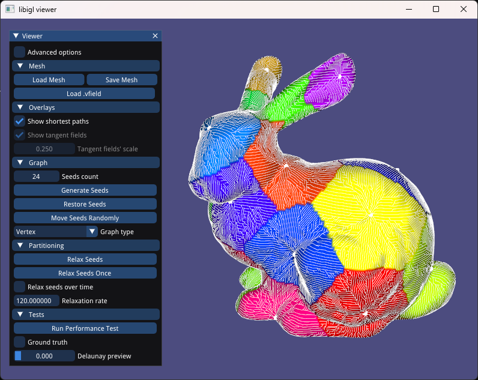
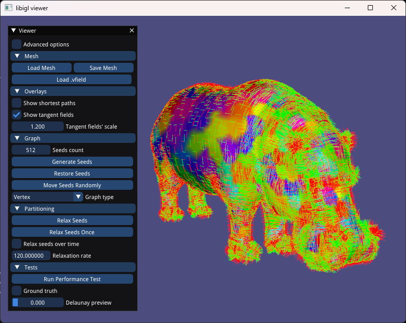

# Discretized Lloyd's algorithm

This project presents an algorithm for computing Centroidal Voronoi Diagrams of a mesh's surface using a discrete clustering approach.

The algorithm is mainly inspierd by Lloyd's, and it only works by simple graph operations on a graph structure built from the input mesh. The resulting tessellation has its centroids points on the mesh's surface from the get-go, without any need to project them.

## Compile
### Linux / MacOS
Compile this project using the standard cmake routine:

    mkdir build
    cd build
    cmake ..
    make

### Windows / Visual Studio 2022
Type the following commands in the prompt:

    mkdir build
    cd build
    cmake .. -G "Visual Studio 17 2022"
